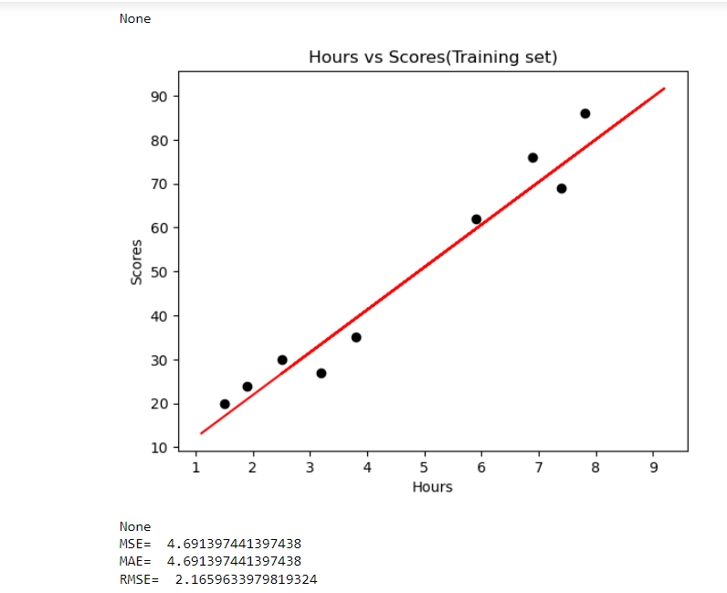

# Implementation-of-Simple-Linear-Regression-Model-for-Predicting-the-Marks-Scored

## AIM:
To write a program to predict the marks scored by a student using the simple linear regression model.

## Equipments Required:
1. Hardware – PCs
2. Anaconda – Python 3.7 Installation / Jupyter notebook

## Algorithm
#### Step1. Start
#### Step2. Import necessary libraries and load the dataset
#### Step3. Preprocess the data (if required)
#### Step4. Split the dataset into training and testing sets
#### Step5. Train the linear regression model using the training set
#### Step6. Make predictions on the testing set
#### Step7. Evaluate the model's performance
#### Step8. Visualize the results
#### Step9. Predict marks for a new input
#### Step10.Stop


## Program:
```
/*
Program to implement the simple linear regression model for predicting the marks scored.
Developed by: Meyyappan.T
RegisterNumber:  212223240086
import pandas as pd
import numpy as np
import matplotlib.pyplot as plt
from sklearn.metrics import mean_absolute_error,mean_squared_error
df=pd.read_csv("C:/Users/admin/Downloads/student_scores.csv")
print(df.head())
print(df.tail())
#segregating data to variables
X=df.iloc[:,:-1].values
print(X)
Y=df.iloc[:,1].values
print(Y)
#splitting training and test data
from sklearn.model_selection import train_test_split
X_train,X_test,Y_train,Y_test=train_test_split(X,Y,test_size=1/3,random_state=0)
from sklearn.linear_model import LinearRegression
regressor=LinearRegression()
regressor.fit(X_train,Y_train)
Y_pred=regressor.predict(X_test)
#displaying predicted values
print(Y_pred)
print(Y_test)
#graph plot for training data
plt.scatter(X_train,Y_train,color="orange")
plt.plot(X_train,regressor.predict(X_train),color="red")
plt.title("Hours vs Scores(Training set)")
plt.xlabel("Hours")
plt.ylabel("Scores")
print(plt.show())
#Graph plot for test data
plt.scatter(X_test,Y_test,color='black')
plt.plot(X_train,regressor.predict(X_train),color="red")
plt.title("Hours vs Scores(Training set)")
plt.xlabel("Hours")
plt.ylabel("Scores")
print(plt.show())
mse=mean_absolute_error(Y_test,Y_pred)
print('MSE= ',mse)
mae=mean_absolute_error(Y_test,Y_pred)
print('MAE= ',mae)
rmse=np.sqrt(mse)
print('RMSE= ',rmse)

*/
```

## Output:
### Printing the values of the data set 

### Hours VS Scores Graph

### Printing the Errors



## Result:
Thus the program to implement the simple linear regression model for predicting the marks scored is written and verified using python programming.
